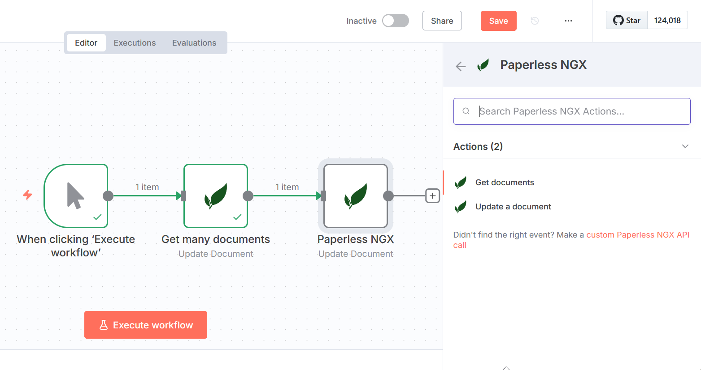

# n8n Node for Paperless-ngx

An n8n community node to automate your Paperless-ngx workflows, simplifying document management and integration with your favorite apps and services.

## 📌 Features

* **Get Documents**: List documents, filterable by tag.
* **Get Tags**: List all tags in your Paperless-ngx.
* **Get Correspondents**: List all correspondents.
* **Update Documents**: Change document titles, add/remove tags.

## 🚀 Quick Start

### Prerequisites

* An [n8n](https://n8n.io) instance.
* A [Paperless-ngx](https://github.com/paperless-ngx/paperless-ngx) instance.

### Installation

1. Open n8n, navigate to **Settings > Community Nodes**.
2. Click **Install**, search for `n8n-nodes-paperless-ngx`.
3. Select and confirm installation.

### Setup Credentials

1. Navigate to **Credentials > New**.
2. Search and select **Paperless-ngx**.
3. Enter your Paperless-ngx URL and API key.
4. Click **Save**.

You're ready to start automating!

## 🎯 Example Workflow Ideas

* Automatically tag and title incoming documents based on their content or using an [AI agent](https://n8n.io/ai/).
* Index newly added documents into [Qdrant](https://qdrant.tech/).
* Sync correspondents and tags with your CRM or task manager.
* Trigger notifications or alerts based on document tags.

## 🤝 Contributing

Your contributions are welcome! Submit ideas or improvements via [GitHub Issues or Pull Requests](https://github.com/nielsmaerten/n8n-nodes-paperless-ngx).  

### 🛣️ Roadmap

The following features are currently planned. If you want to contribute, these are a good place to start. Make sure to read [CONTRIBUTORS.md](CONTRIBUTORS.md) to understand the project's structure.

- [ ] Create
  - [ ] a new document
  - [ ] a new tag
  - [ ] a new correspondent
- [ ] Modify
  - [ ] a document's correspondent
  - [x] a document's title
  - [x] a document's tags
- [x] List
  - [x] tags
  - [x] correspondents
  - [x] documents (by tag)

## 📄 License

[MIT License](LICENSE.md).
